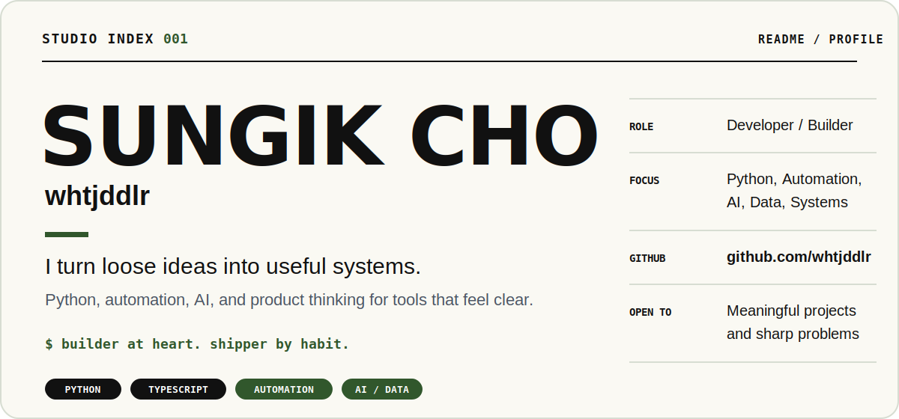
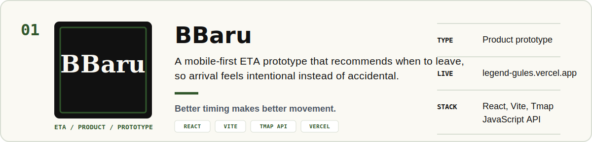
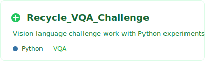
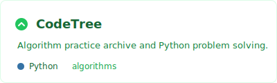
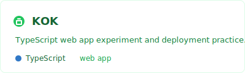
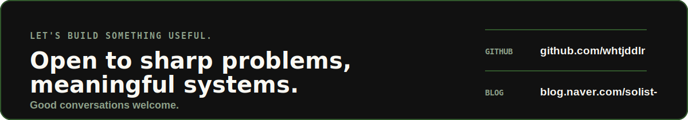

  

 

  
    
  
    
  
    
  

 

<table>
  <tr>
    <td width="50%" valign="top">
      
    </td>
    <td width="50%" valign="top">
      
    </td>
  </tr>
</table>

 

  <picture>
    <source media="(prefers-color-scheme: dark)" srcset="https://raw.githubusercontent.com/whtjddlr/whtjddlr/output/github-snake-dark.svg">
    <source media="(prefers-color-scheme: light)" srcset="https://raw.githubusercontent.com/whtjddlr/whtjddlr/output/github-snake.svg">
    
  </picture>

 

  
Latest writing

<!-- BLOG-POST-LIST:START -->
<!-- BLOG-POST-LIST:END -->

 

  

 

  

