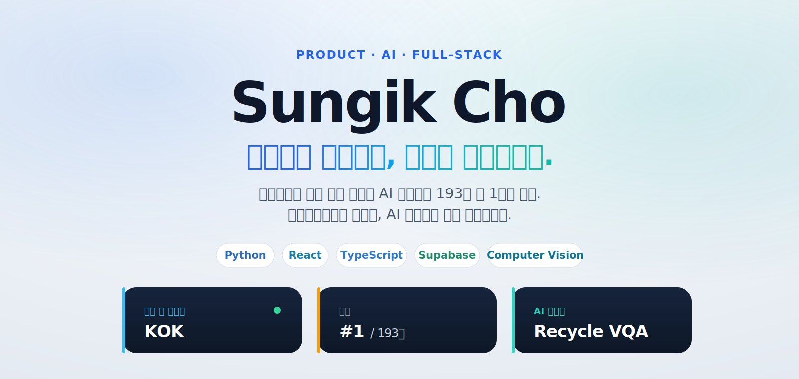
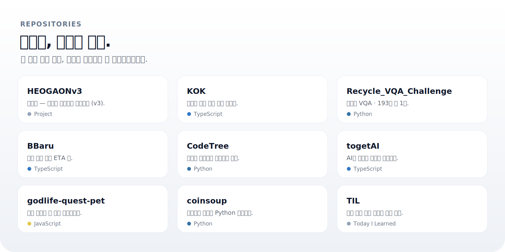
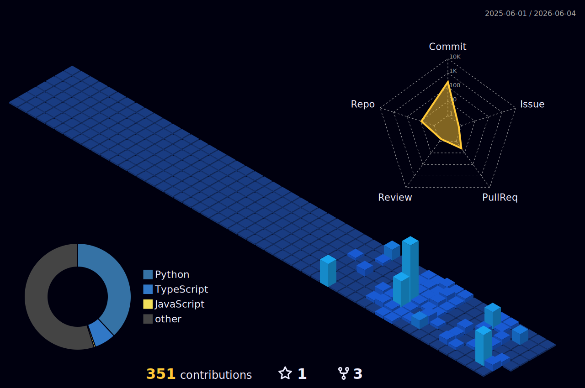

  

 

WEB · AI · 꾸준한 기록

웹과 AI를 공부하며 만든 것들을 여기에 모아둡니다. 
크게 내세우기보다, 끝까지 만들어보는 걸 좋아합니다.

 

 

  

[KOK](https://github.com/whtjddlr/KOK)
&nbsp;·&nbsp;
[Recycle VQA](https://github.com/whtjddlr/Recycle_VQA_Challenge)
&nbsp;·&nbsp;
[BBaru](https://github.com/whtjddlr/BBaru)
&nbsp;·&nbsp;
[CodeTree](https://github.com/whtjddlr/CodeTree)
&nbsp;·&nbsp;
[togetAI](https://github.com/whtjddlr/togetAI)
&nbsp;·&nbsp;
[godlife-quest-pet](https://github.com/whtjddlr/godlife-quest-pet)
&nbsp;·&nbsp;
[coinsoup](https://github.com/whtjddlr/coinsoup)
&nbsp;·&nbsp;
[TIL](https://github.com/whtjddlr/TIL)

그 외 저장소는 <a href="https://github.com/whtjddlr?tab=repositories">전체 목록</a>에서 볼 수 있습니다.

 

  <a href="https://kok-meet.vercel.app/">▶ KOK 데모 보기</a>

 

  

 

> 잘하는 사람은 많으니, 저는 꾸준히 끝까지 만들어보려 합니다.

 

  
최근 글

 

<!-- BLOG-POST-LIST:START -->
- [SSAFYcial writing archive](https://blog.naver.com/solist-/224298671341?fromRss=true&trackingCode=rss)
- [AI coding agent article](https://blog.naver.com/solist-/224289030538?fromRss=true&trackingCode=rss)
- [Code translation notes](https://blog.naver.com/solist-/224267591707?fromRss=true&trackingCode=rss)
- [Harness engineering article](https://blog.naver.com/solist-/224259717090?fromRss=true&trackingCode=rss)
- [SSAFYcial archive](https://blog.naver.com/solist-/224234495402?fromRss=true&trackingCode=rss)
<!-- BLOG-POST-LIST:END -->

