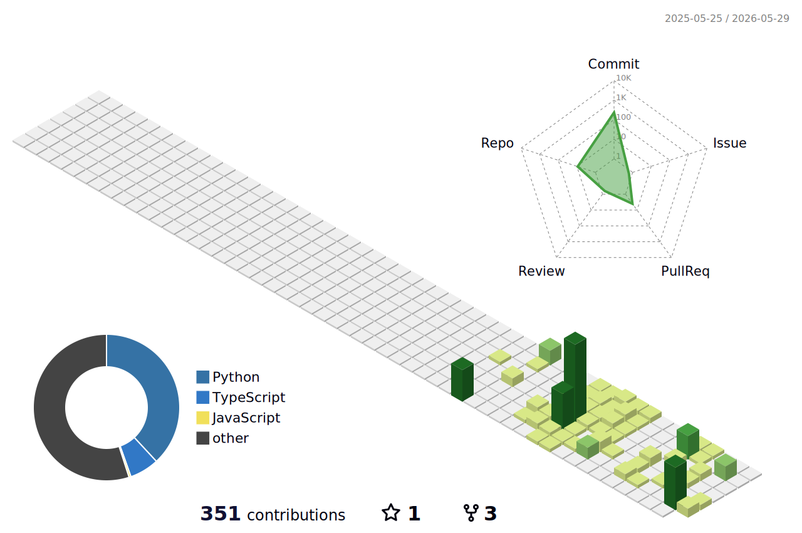

  

 

PRODUCT · AI · FULL-STACK

기획부터 출시까지, 제품을 끝까지 완성합니다. 
실서비스 운영 경험과 AI 경진대회 193팀 중 1위 기록.

 

 

&nbsp;

&nbsp;

&nbsp;

 

  

 

  

 

&nbsp;

&nbsp;

 

  

 

&nbsp;

 

  

 

  

 

> 만드는 데서 멈추지 않고, 사용자에게 닿을 때까지 완성합니다.

 

  
최근 글

 

<!-- BLOG-POST-LIST:START -->
- [SSAFYcial writing archive](https://blog.naver.com/solist-/224298671341?fromRss=true&trackingCode=rss)
- [AI coding agent article](https://blog.naver.com/solist-/224289030538?fromRss=true&trackingCode=rss)
- [Code translation notes](https://blog.naver.com/solist-/224267591707?fromRss=true&trackingCode=rss)
- [Harness engineering article](https://blog.naver.com/solist-/224259717090?fromRss=true&trackingCode=rss)
- [SSAFYcial archive](https://blog.naver.com/solist-/224234495402?fromRss=true&trackingCode=rss)
<!-- BLOG-POST-LIST:END -->

