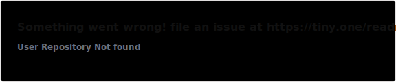

<h1>Sungik Cho</h1>

  Building useful systems with clarity, structure, and consistency.

 

 

## Selected Projects

 

 

 

## Recent Activity

<!--RECENT_ACTIVITY:start-->
<!--RECENT_ACTIVITY:end-->
