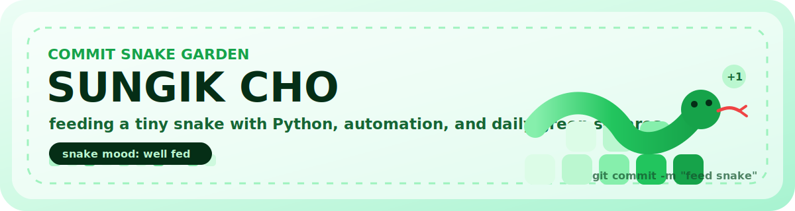

 
 

Python, GitHub Actions, automation, and little commits for a very hungry contribution snake.

 
 

<code>Python</code>
<code>Automation</code>
<code>Problem Solving</code>
<code>AI Workflow</code>
<code>SSAFY</code>

 

## Commit Snake

<picture>
  <source media="(prefers-color-scheme: dark)" srcset="https://raw.githubusercontent.com/whtjddlr/whtjddlr/output/github-snake-dark.svg">
  
</picture>

 

Every green square is a snack. The snake gets happier when the garden grows.

 

## Snack Counter

 

## Little Project Shelf

<table>
  <tr>
    <td width="50%">
      <a href="https://github.com/whtjddlr/CodeTree"><strong>CodeTree</strong></a>
       
      Daily algorithm bites and Python problem solving.
       
       
      <code>Python</code> <code>Algorithms</code>
    </td>
    <td width="50%">
      <a href="https://github.com/whtjddlr/Recycle_VQA_Challenge"><strong>Recycle_VQA_Challenge</strong></a>
       
      Vision-language experiments with a data-first workflow.
       
       
      <code>Python</code> <code>VQA</code>
    </td>
  </tr>
  <tr>
    <td width="50%">
      <a href="https://github.com/whtjddlr/BBaru"><strong>BBaru</strong></a>
       
      TypeScript product work and fast iteration practice.
       
       
      <code>TypeScript</code> <code>Product</code>
    </td>
    <td width="50%">
      <a href="https://github.com/whtjddlr/KOK"><strong>KOK</strong></a>
       
      A web app experiment for deployment and UI practice.
       
       
      <code>TypeScript</code> <code>Vercel</code>
    </td>
  </tr>
</table>

 

## Latest Blog Posts

<!-- BLOG-POST-LIST:START -->
- [[SSAFYcial 기획 기사] 이 코드도 통역 되나요? : 자주 뜨는 에러 번역 사전](https://blog.naver.com/solist-/224267591707?fromRss=true&trackingCode=rss)
- [[SSAFYcial] AI 에이전트를 제대로 쓰는 법 — 하네스 엔지니어링&lpar;Harness Engineering&rpar;이란?](https://blog.naver.com/solist-/224259717090?fromRss=true&trackingCode=rss)
- [[SSAFYcial 기획 기사] 이 코드도 통역 되나요?](https://blog.naver.com/solist-/224234495402?fromRss=true&trackingCode=rss)
- [[SSAFYcial] AI가 혼자 PPT를 만든다고? AI 에이전트 이야기](https://blog.naver.com/solist-/224227443589?fromRss=true&trackingCode=rss)
- [SSAFY 15기 비전공자 한 달차 솔직 리포트 &lpar;feat . 8명의 천사들의 SSAFY 후기&rpar;](https://blog.naver.com/solist-/224195058217?fromRss=true&trackingCode=rss)
<!-- BLOG-POST-LIST:END -->

 

## Garden Metrics

