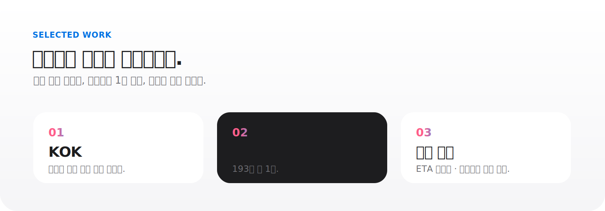
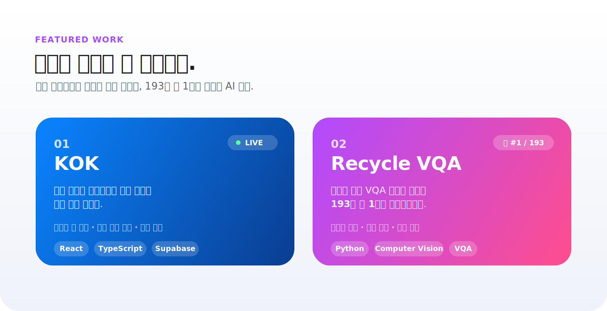

  

 

제품 개발 · AI 실험 · 조용한 실행

실제로 쓰이는 제품과 검증 가능한 AI 결과를 만듭니다. 
작게 시작하고, 끝까지 작동하게 만들고, 다시 단순하게 다듬습니다.

 

<kbd>Python</kbd>
<kbd>React</kbd>
<kbd>TypeScript</kbd>
<kbd>Supabase</kbd>
<kbd>Computer Vision</kbd>

 
 

<a href="https://github.com/whtjddlr/KOK">KOK</a>
&nbsp;&nbsp;·&nbsp;&nbsp;
<a href="https://github.com/whtjddlr/Recycle_VQA_Challenge">Recycle VQA</a>
&nbsp;&nbsp;·&nbsp;&nbsp;
<a href="https://github.com/whtjddlr/BBaru">BBaru</a>
&nbsp;&nbsp;·&nbsp;&nbsp;
<a href="https://github.com/whtjddlr/CodeTree">CodeTree</a>

 

  

 

  

 

  <a href="https://kok-meet.vercel.app/">KOK Live</a>
  &nbsp;&nbsp;·&nbsp;&nbsp;
  <a href="https://github.com/whtjddlr/KOK">KOK Repository</a>
  &nbsp;&nbsp;·&nbsp;&nbsp;
  <a href="https://github.com/whtjddlr/Recycle_VQA_Challenge">Recycle VQA Repository</a>

 

  

 

  <a href="https://github.com/whtjddlr/BBaru">BBaru Repository</a>
  &nbsp;&nbsp;·&nbsp;&nbsp;
  <a href="https://github.com/whtjddlr/CodeTree">CodeTree Repository</a>

 

> 좋은 제품은 조용하게 느껴집니다. 
> 할 일을 해내고, 질문을 줄이고, 다음 행동을 자연스럽게 만듭니다.

 

  
최근 글

<!-- BLOG-POST-LIST:START -->
- [SSAFYcial writing archive](https://blog.naver.com/solist-/224298671341?fromRss=true&trackingCode=rss)
- [AI coding agent article](https://blog.naver.com/solist-/224289030538?fromRss=true&trackingCode=rss)
- [Code translation notes](https://blog.naver.com/solist-/224267591707?fromRss=true&trackingCode=rss)
- [Harness engineering article](https://blog.naver.com/solist-/224259717090?fromRss=true&trackingCode=rss)
- [SSAFYcial archive](https://blog.naver.com/solist-/224234495402?fromRss=true&trackingCode=rss)
<!-- BLOG-POST-LIST:END -->

