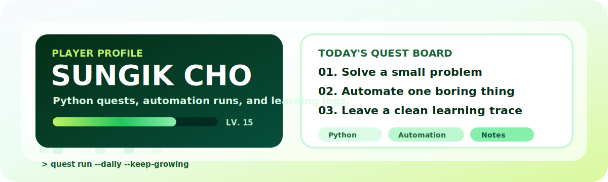

<div align="center">



<br/>
<br/>

<sub>
Small quests, steady commits, and practical automation.
</sub>

<br/>
<br/>

<code>Python</code>
<code>Algorithms</code>
<code>Automation</code>
<code>AI Workflow</code>
<code>SSAFY</code>

</div>

<br/>

## Quest Log

```txt
> booting daily_quest.exe
> player: sungik
> mode: learn by building
> current stack: python / github actions / small useful tools
```

<table>
  <tr>
    <td width="33%"><strong>Daily Problem</strong><br/><sub>Keep problem-solving muscles awake.</sub></td>
    <td width="33%"><strong>Useful Automation</strong><br/><sub>Turn repeated work into tiny tools.</sub></td>
    <td width="33%"><strong>Learning Trace</strong><br/><sub>Leave notes, commits, and blog posts behind.</sub></td>
  </tr>
</table>

<br/>

## Arcade Break

<div align="center">


</div>

<br/>

## Skill Garden

<div align="center">


</div>

<br/>

## Project Board

<table>
  <tr>
    <td width="50%">
      <a href="https://github.com/whtjddlr/CodeTree"><strong>CodeTree</strong></a>
      <br/>
      <sub>Algorithm practice archive and Python problem solving.</sub>
      <br/>
      <br/>
      <code>Python</code> <code>Algorithms</code>
    </td>
    <td width="50%">
      <a href="https://github.com/whtjddlr/Recycle_VQA_Challenge"><strong>Recycle_VQA_Challenge</strong></a>
      <br/>
      <sub>Vision-language experiments with a data-first workflow.</sub>
      <br/>
      <br/>
      <code>Python</code> <code>VQA</code>
    </td>
  </tr>
  <tr>
    <td width="50%">
      <a href="https://github.com/whtjddlr/BBaru"><strong>BBaru</strong></a>
      <br/>
      <sub>TypeScript product work and fast iteration practice.</sub>
      <br/>
      <br/>
      <code>TypeScript</code> <code>Product</code>
    </td>
    <td width="50%">
      <a href="https://github.com/whtjddlr/KOK"><strong>KOK</strong></a>
      <br/>
      <sub>A web app experiment for deployment and UI practice.</sub>
      <br/>
      <br/>
      <code>TypeScript</code> <code>Vercel</code>
    </td>
  </tr>
</table>

<br/>

## Latest Blog Posts

<!-- BLOG-POST-LIST:START -->
- [[SSAFYcial 기획 기사] 이 코드도 통역 되나요? : 자주 뜨는 에러 번역 사전](https://blog.naver.com/solist-/224267591707?fromRss=true&trackingCode=rss)
- [[SSAFYcial] AI 에이전트를 제대로 쓰는 법 — 하네스 엔지니어링&lpar;Harness Engineering&rpar;이란?](https://blog.naver.com/solist-/224259717090?fromRss=true&trackingCode=rss)
- [[SSAFYcial 기획 기사] 이 코드도 통역 되나요?](https://blog.naver.com/solist-/224234495402?fromRss=true&trackingCode=rss)
- [[SSAFYcial] AI가 혼자 PPT를 만든다고? AI 에이전트 이야기](https://blog.naver.com/solist-/224227443589?fromRss=true&trackingCode=rss)
- [SSAFY 15기 비전공자 한 달차 솔직 리포트 &lpar;feat . 8명의 천사들의 SSAFY 후기&rpar;](https://blog.naver.com/solist-/224195058217?fromRss=true&trackingCode=rss)
<!-- BLOG-POST-LIST:END -->

<br/>

## Metrics

<div align="center">


</div>
