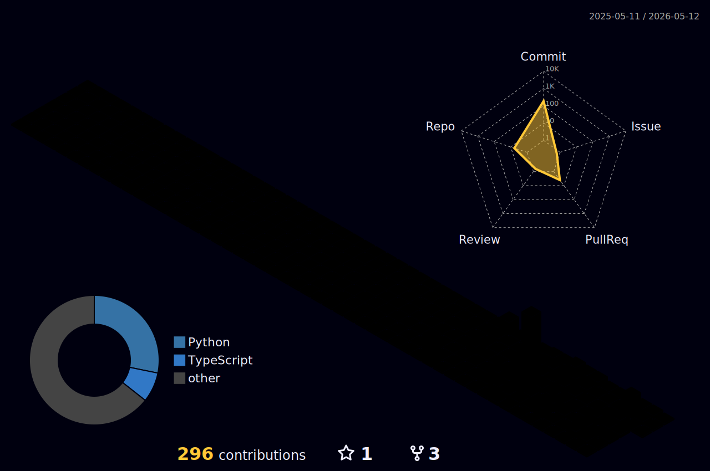

 

 

  
  

 

  

 

## Selected Work

<table>
<tr>
<td width="33%" valign="top">

### TransitSmart  
Personalized transit ETA ideas  
Mobility-focused product thinking  
Routing, timing, and usability

</td>
<td width="33%" valign="top">

### Algorithm Archive  
DFS · BFS · Backtracking  
Implementation and optimization  
Problem solving patterns

</td>
<td width="33%" valign="top">

### UI Experiments  
Minimal interface studies  
Layout and interaction tests  
Clean frontend structure

</td>
</tr>
</table>

 

## Showcase

  
  

  
  

> Replace the repository names above with your actual repositories.

 

## Activity

  

 

## 3D Contributions

  

 

  

