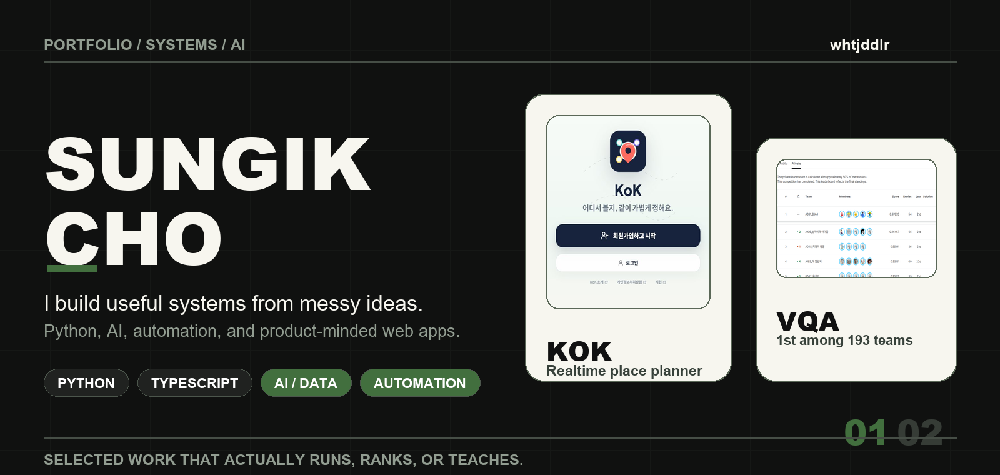
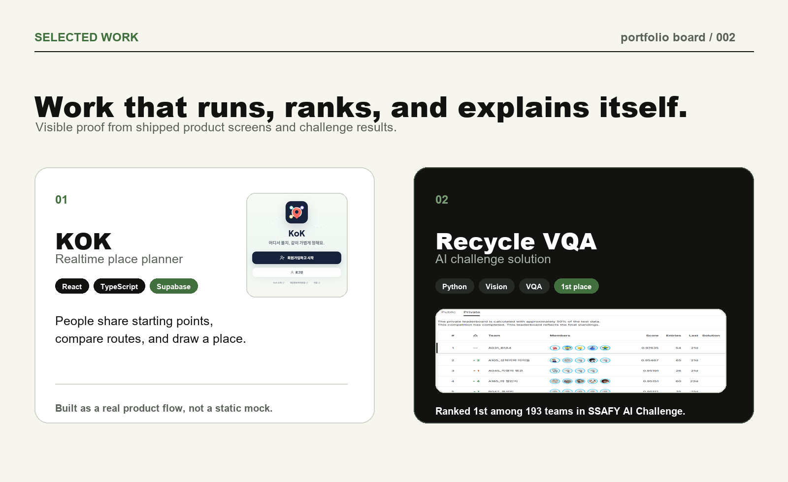

  

 

<table>
  <tr>
    <td align="center" width="25%"><strong>Live product</strong> KOK</td>
    <td align="center" width="25%"><strong>AI challenge</strong> 1st / 193 teams</td>
    <td align="center" width="25%"><strong>Main language</strong> Python</td>
    <td align="center" width="25%"><strong>Working mode</strong> Build, test, refine</td>
  </tr>
</table>

 

  

<table>
  <tr>
    <td width="50%" valign="top">
      <h3>KOK</h3>
      
Realtime meeting-place planner with shared starting points, route comparison, and live draw flow.

      
<a href="https://github.com/whtjddlr/KOK">Repository</a> &middot; <a href="https://kok-meet.vercel.app/">Live</a>

    </td>
    <td width="50%" valign="top">
      <h3>Recycle VQA Challenge</h3>
      
Visual question answering solution for recycling images, ranked 1st among 193 teams.

      
<a href="https://github.com/whtjddlr/Recycle_VQA_Challenge">Repository</a>

    </td>
  </tr>
</table>

## More Builds

| Project | What it is | Stack |
| --- | --- | --- |
| [BBaru](https://github.com/whtjddlr/BBaru) | ETA product prototype that recommends when to leave for a target arrival time. | React, Vite, Tmap API |
| [CodeTree](https://github.com/whtjddlr/CodeTree) | Algorithm archive for steady problem solving and fundamentals practice. | Python |

## Activity

<table>
  <tr>
    <td width="50%" valign="top">
      
    </td>
    <td width="50%" valign="top">
      
    </td>
  </tr>
</table>

  
Latest writing

<!-- BLOG-POST-LIST:START -->
- [[SSAFYcial 기획 기사] 이 코드도 통역 되나요? : Git이 뭔데?](https://blog.naver.com/solist-/224298671341?fromRss=true&trackingCode=rss)
- [[SSAFYcial] 요즘 개발자들은 어떤 AI 코딩 에이전트를 쓸까?](https://blog.naver.com/solist-/224289030538?fromRss=true&trackingCode=rss)
- [[SSAFYcial 기획 기사] 이 코드도 통역 되나요? : 자주 뜨는 에러 번역 사전](https://blog.naver.com/solist-/224267591707?fromRss=true&trackingCode=rss)
- [[SSAFYcial] AI 에이전트를 제대로 쓰는 법 — 하네스 엔지니어링&lpar;Harness Engineering&rpar;이란?](https://blog.naver.com/solist-/224259717090?fromRss=true&trackingCode=rss)
- [[SSAFYcial 기획 기사] 이 코드도 통역 되나요?](https://blog.naver.com/solist-/224234495402?fromRss=true&trackingCode=rss)
<!-- BLOG-POST-LIST:END -->

