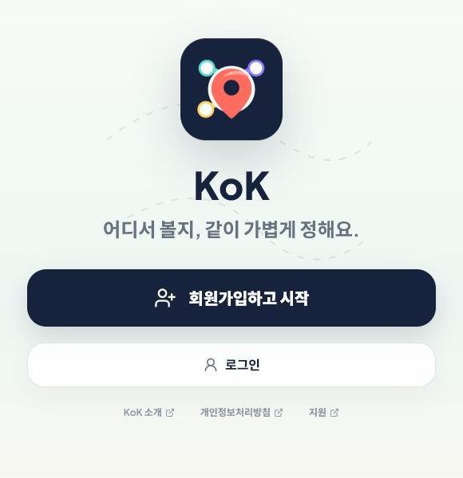
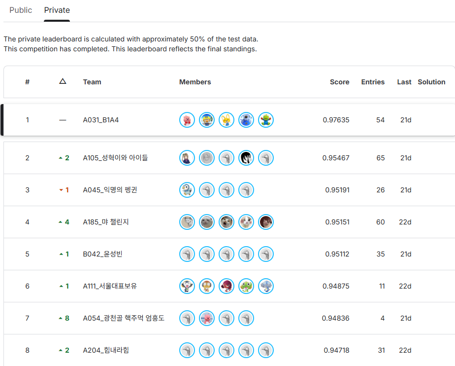

  

 

<table>
  <tr>
    <td align="center" width="25%"><strong>Live product</strong> KOK</td>
    <td align="center" width="25%"><strong>AI challenge</strong> 1st / 193 teams</td>
    <td align="center" width="25%"><strong>Main language</strong> Python</td>
    <td align="center" width="25%"><strong>Working mode</strong> Build, test, refine</td>
  </tr>
</table>

## Selected Work

### 01. KOK

<table>
  <tr>
    <td width="42%" valign="top">
      
    </td>
    <td width="58%" valign="top">
      

        A realtime meeting-place planner where people share starting points,
        compare routes, and choose the final spot through a shared draw.
      

      

        <code>React</code> <code>TypeScript</code> <code>Supabase</code>
        <code>Naver Maps</code>
      

      

        <a href="https://github.com/whtjddlr/KOK">Repository</a>
        &middot;
        <a href="https://kok-meet.vercel.app/">Live</a>
      

    </td>
  </tr>
</table>

### 02. Recycle VQA Challenge

<table>
  <tr>
    <td width="58%" valign="top">
      
    </td>
    <td width="42%" valign="top">
      

        A visual question answering solution for recycling images. Built for
        the SSAFY AI Challenge and ranked 1st among 193 teams.
      

      

        <code>Python</code> <code>Computer Vision</code> <code>VQA</code>
        <code>AI Challenge</code>
      

      

        <a href="https://github.com/whtjddlr/Recycle_VQA_Challenge">Repository</a>
      

    </td>
  </tr>
</table>

## More Builds

| Project | What it is | Stack |
| --- | --- | --- |
| [BBaru](https://github.com/whtjddlr/BBaru) | ETA product prototype that recommends when to leave for a target arrival time. | React, Vite, Tmap API |
| [CodeTree](https://github.com/whtjddlr/CodeTree) | Algorithm archive for steady problem solving and fundamentals practice. | Python |

## Activity

<table>
  <tr>
    <td width="50%" valign="top">
      
    </td>
    <td width="50%" valign="top">
      
    </td>
  </tr>
</table>

  
Latest writing

<!-- BLOG-POST-LIST:START -->
<!-- BLOG-POST-LIST:END -->

