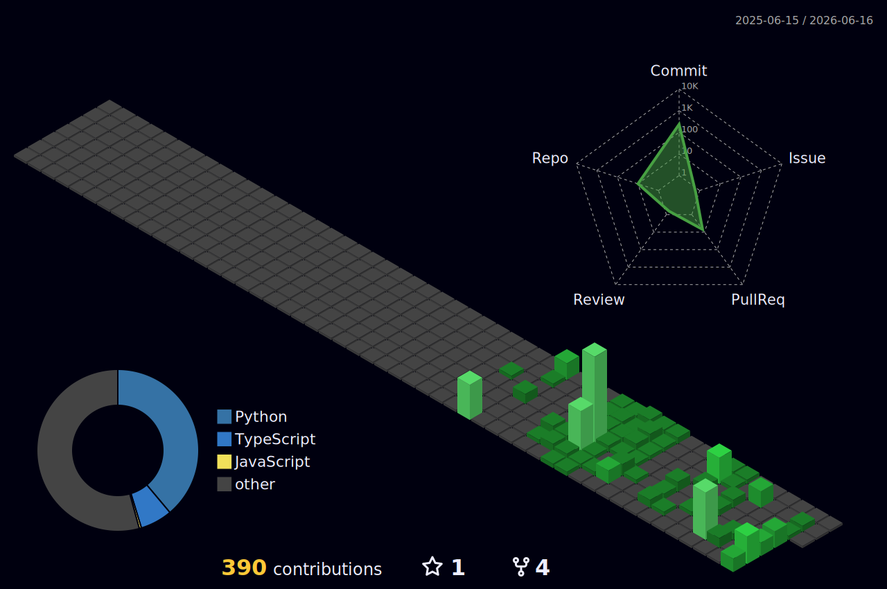

<div align="center">
  
</div>

<br/>

<div align="center">

```console
$ whoami
Sungik Cho — 제품 개발 · AI 실험 · 조용한 실행

실제로 쓰이는 제품과 검증 가능한 AI 결과를 만듭니다.
작게 시작하고, 끝까지 작동하게 만들고, 다시 단순하게 다듬습니다.
```

</div>

<div align="center">


[](https://github.com/whtjddlr/KOK)
[](https://github.com/whtjddlr/Recycle_VQA_Challenge)
[](https://github.com/whtjddlr/BBaru)
[](https://github.com/whtjddlr/CodeTree)

</div>

<br/>

<div align="center">
  
</div>

<br/>

<div align="center">
  
</div>

<br/>

<div align="center">

[](https://kok-meet.vercel.app/)
[](https://github.com/whtjddlr/KOK)
[](https://github.com/whtjddlr/Recycle_VQA_Challenge)

</div>

<br/>

<div align="center">
  
</div>

<br/>

<div align="center">

[](https://github.com/whtjddlr/BBaru)
[](https://github.com/whtjddlr/CodeTree)

</div>

<br/>

<!-- ░░ snake contribution animation — generated by .github/workflows/snake.yml ░░ -->
<div align="center">
  
</div>

<br/>

<div align="center">
  
</div>

<br/>

<div align="center">

```console
$ cat philosophy.txt
# 좋은 제품은 조용하게 느껴진다.
# 할 일을 해내고, 질문을 줄이고, 다음 행동을 자연스럽게 만든다.
```

</div>

<br/>

<details>
  <summary>$ tail -f blog.log</summary>

<br/>

<!-- BLOG-POST-LIST:START -->
- [SSAFYcial writing archive](https://blog.naver.com/solist-/224298671341?fromRss=true&trackingCode=rss)
- [AI coding agent article](https://blog.naver.com/solist-/224289030538?fromRss=true&trackingCode=rss)
- [Code translation notes](https://blog.naver.com/solist-/224267591707?fromRss=true&trackingCode=rss)
- [Harness engineering article](https://blog.naver.com/solist-/224259717090?fromRss=true&trackingCode=rss)
- [SSAFYcial archive](https://blog.naver.com/solist-/224234495402?fromRss=true&trackingCode=rss)
<!-- BLOG-POST-LIST:END -->

</details>
