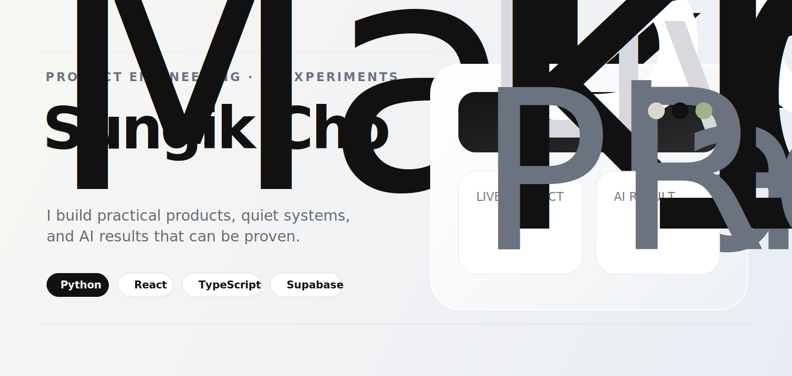
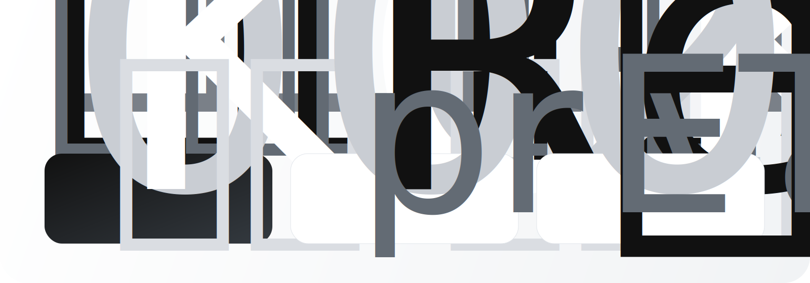

  

 

제품 개발 · AI 실험 · 조용한 실행

실제로 쓰이는 제품과 검증 가능한 AI 결과를 만듭니다. 
작게 시작하고, 끝까지 작동하게 만들고, 다시 단순하게 다듬습니다.

 

<kbd>Python</kbd>
<kbd>React</kbd>
<kbd>TypeScript</kbd>
<kbd>Supabase</kbd>
<kbd>Computer Vision</kbd>

 
 

<a href="https://github.com/whtjddlr/KOK">KOK</a>
&nbsp;&nbsp;·&nbsp;&nbsp;
<a href="https://github.com/whtjddlr/Recycle_VQA_Challenge">Recycle VQA</a>
&nbsp;&nbsp;·&nbsp;&nbsp;
<a href="https://github.com/whtjddlr/BBaru">BBaru</a>
&nbsp;&nbsp;·&nbsp;&nbsp;
<a href="https://github.com/whtjddlr/CodeTree">CodeTree</a>

 

  

 

<table>
  <tr>
    <td align="center" width="33%">
      제품
      <h3>KOK</h3>
      
약속 장소를 정하는 흐름을 더 가볍게.

    </td>
    <td align="center" width="33%">
      성과
      <h3>1위 / 193팀</h3>
      
Recycle VQA private 리더보드.

    </td>
    <td align="center" width="33%">
      방식
      <h3>만들고, 배우고, 다듬기</h3>
      
빠르게 만들고 조용히 개선합니다.

    </td>
  </tr>
</table>

 

## 대표 작업

 

<table>
  <tr>
    <td width="14%" valign="top">
      <h2>01</h2>
    </td>
    <td width="86%" valign="top">
      <h2>KOK</h2>
      
<strong>어디서 볼지, 같이 가볍게 정하는 약속 장소 플래너.</strong>

      

        여러 출발지를 기준으로 후보 장소와 이동 흐름을 비교하고,
        실시간 방 참여와 추첨 흐름까지 하나의 제품 경험으로 묶었습니다.
      

      

        <kbd>React</kbd>
        <kbd>TypeScript</kbd>
        <kbd>Supabase</kbd>
        <kbd>Naver Maps</kbd>
      

      

        <a href="https://kok-meet.vercel.app/">Live</a>
        &nbsp;·&nbsp;
        <a href="https://github.com/whtjddlr/KOK">Repository</a>
      

    </td>
  </tr>
</table>

 

<table>
  <tr>
    <td width="14%" valign="top">
      <h2>02</h2>
    </td>
    <td width="86%" valign="top">
      <h2>Recycle VQA Challenge</h2>
      
<strong>이미지 기반 VQA 문제를 해결해 193팀 중 1위.</strong>

      

        재활용 이미지의 질문-응답 성능을 높이기 위해 데이터 관찰, 학습 전략,
        제출 실험을 반복하며 최종 리더보드 성과를 만들었습니다.
      

      

        <kbd>Python</kbd>
        <kbd>Computer Vision</kbd>
        <kbd>VQA</kbd>
        <kbd>Experiment</kbd>
      

      

        <a href="https://github.com/whtjddlr/Recycle_VQA_Challenge">Repository</a>
      

    </td>
  </tr>
</table>

 

## 작지만 완성도 있게

<table>
  <tr>
    <td width="50%" valign="top">
      <h3>BBaru</h3>
      
목표 도착 시간에 맞춰 언제 출발해야 하는지 계산하는 ETA 기반 프로토타입.

      
<kbd>React</kbd> <kbd>Vite</kbd> <kbd>Tmap API</kbd>

      
<a href="https://github.com/whtjddlr/BBaru">Repository</a>

    </td>
    <td width="50%" valign="top">
      <h3>CodeTree</h3>
      
문제 해결 감각을 유지하기 위한 알고리즘 풀이 아카이브.

      
<kbd>Python</kbd> <kbd>Algorithms</kbd>

      
<a href="https://github.com/whtjddlr/CodeTree">Repository</a>

    </td>
  </tr>
</table>

 

> 좋은 제품은 조용하게 느껴집니다. 
> 할 일을 해내고, 질문을 줄이고, 다음 행동을 자연스럽게 만듭니다.

 

  
최근 글

<!-- BLOG-POST-LIST:START -->
- [SSAFYcial writing archive](https://blog.naver.com/solist-/224298671341?fromRss=true&trackingCode=rss)
- [AI coding agent article](https://blog.naver.com/solist-/224289030538?fromRss=true&trackingCode=rss)
- [Code translation notes](https://blog.naver.com/solist-/224267591707?fromRss=true&trackingCode=rss)
- [Harness engineering article](https://blog.naver.com/solist-/224259717090?fromRss=true&trackingCode=rss)
- [SSAFYcial archive](https://blog.naver.com/solist-/224234495402?fromRss=true&trackingCode=rss)
<!-- BLOG-POST-LIST:END -->

