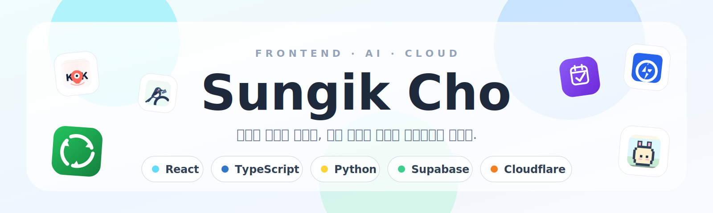
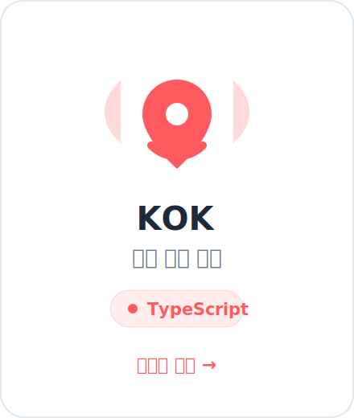
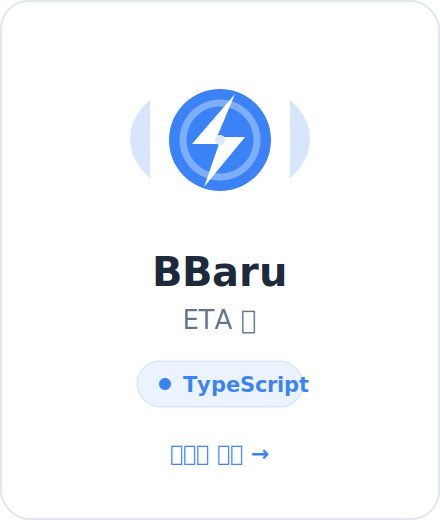
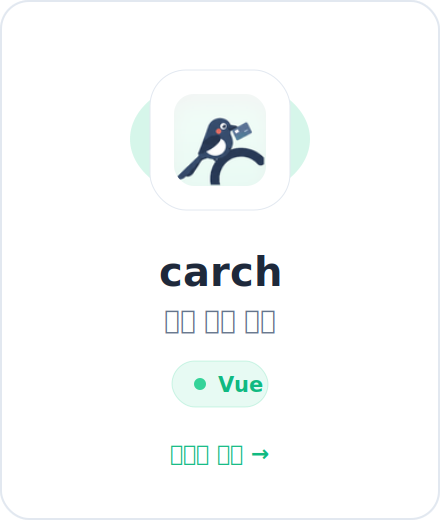
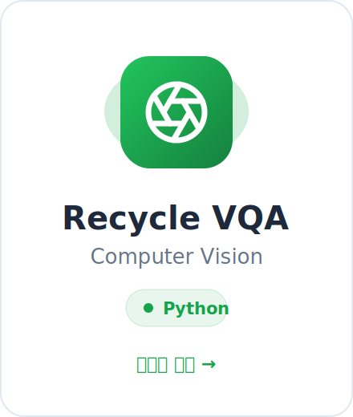
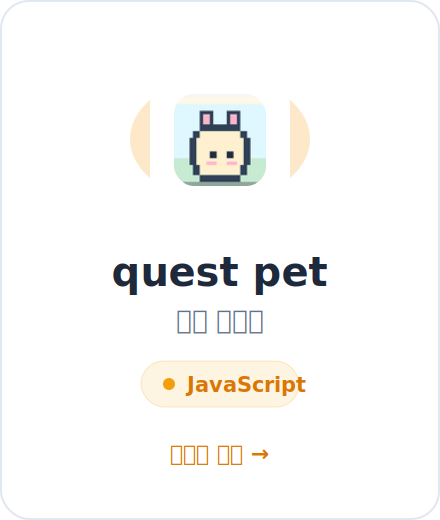

  <picture>
    <source media="(prefers-color-scheme: dark)" srcset="./profile/cards/hero-dark.svg">
    
  </picture>

 

  <a href="https://whtjddlr-readme-launcher.choim2013.workers.dev/go/kok">
    <picture>
      <source media="(prefers-color-scheme: dark)" srcset="./profile/cards/kok-dark.svg">
      
    </picture>
  </a>
  &nbsp;&nbsp;
  <a href="https://whtjddlr-readme-launcher.choim2013.workers.dev/go/bbaru">
    <picture>
      <source media="(prefers-color-scheme: dark)" srcset="./profile/cards/bbaru-dark.svg">
      
    </picture>
  </a>
  &nbsp;&nbsp;
  <a href="https://whtjddlr-readme-launcher.choim2013.workers.dev/go/carch">
    <picture>
      <source media="(prefers-color-scheme: dark)" srcset="./profile/cards/carch-dark.svg">
      
    </picture>
  </a>
   
  <a href="https://whtjddlr-readme-launcher.choim2013.workers.dev/go/planmerge-ai">
    <picture>
      <source media="(prefers-color-scheme: dark)" srcset="./profile/cards/planmerge-ai-dark.svg">
      
    </picture>
  </a>
  &nbsp;&nbsp;
  <a href="https://whtjddlr-readme-launcher.choim2013.workers.dev/go/recycle-vqa">
    <picture>
      <source media="(prefers-color-scheme: dark)" srcset="./profile/cards/recycle-vqa-dark.svg">
      
    </picture>
  </a>
  &nbsp;&nbsp;
  <a href="https://whtjddlr-readme-launcher.choim2013.workers.dev/go/godlife-quest-pet">
    <picture>
      <source media="(prefers-color-scheme: dark)" srcset="./profile/cards/godlife-quest-pet-dark.svg">
      
    </picture>
  </a>

 

  <picture>
    <source media="(prefers-color-scheme: dark)" srcset="./profile-3d-contrib/profile-night-green.svg">
    
  </picture>

 

### ✍️ 최근 글

<!-- BLOG-POST-LIST:START -->
- [[SSAFYcial 기획 기사] 이 코드도 통역 되나요? : VS Code 단축키 추천](https://blog.naver.com/solist-/224335067565?fromRss=true&trackingCode=rss)
- [SSAFY x Kakao Tech Bootcamp AI 해커톤 본선 참가 후기](https://blog.naver.com/solist-/224325367395?fromRss=true&trackingCode=rss)
- [[SSAFYcial 기획 기사] 이 코드도 통역 되나요? : Git이 뭔데?](https://blog.naver.com/solist-/224298671341?fromRss=true&trackingCode=rss)
- [[SSAFYcial] 요즘 개발자들은 어떤 AI 코딩 에이전트를 쓸까?](https://blog.naver.com/solist-/224289030538?fromRss=true&trackingCode=rss)
- [[SSAFYcial 기획 기사] 이 코드도 통역 되나요? : 자주 뜨는 에러 번역 사전](https://blog.naver.com/solist-/224267591707?fromRss=true&trackingCode=rss)
<!-- BLOG-POST-LIST:END -->
