 

 

 

<picture>
  <source media="(prefers-color-scheme: dark)" srcset="https://raw.githubusercontent.com/whtjddlr/whtjddlr/output/github-contribution-grid-snake-dark.svg">
  <source media="(prefers-color-scheme: light)" srcset="https://raw.githubusercontent.com/whtjddlr/whtjddlr/output/github-contribution-grid-snake.svg">
  
</picture>

 

 

 

 

## Projects

 

 

 

## Now Playing

 

## Latest Blog Posts

<!-- BLOG-POST-LIST:START -->
- [SSAFY 15기 비전공자 한 달차 솔직 리포트 &lpar;feat . 8명의 천사들의 SSAFY 후기&rpar;](https://blog.naver.com/solist-/224195058217?fromRss=true&trackingCode=rss)
<!-- BLOG-POST-LIST:END -->

 

 

## Metrics

