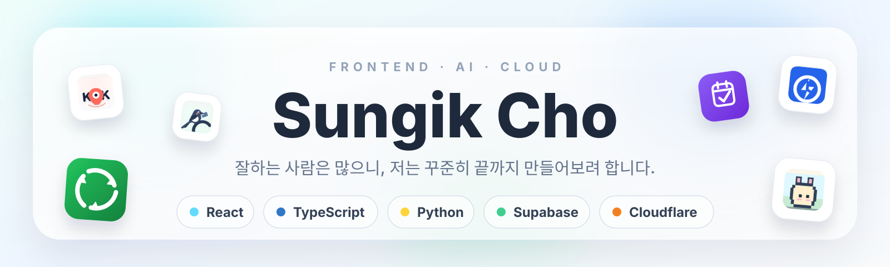
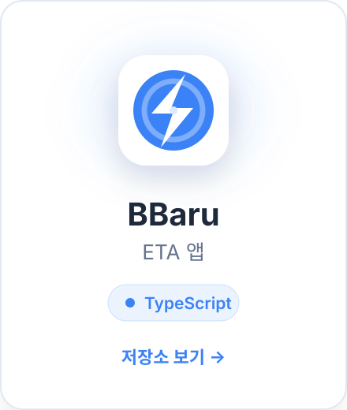
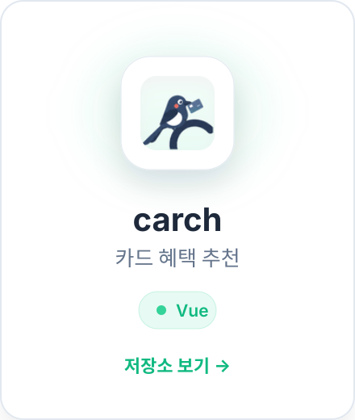
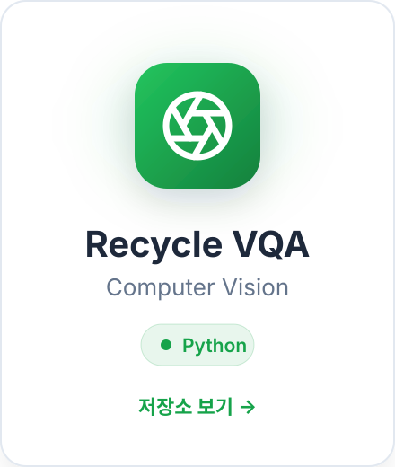
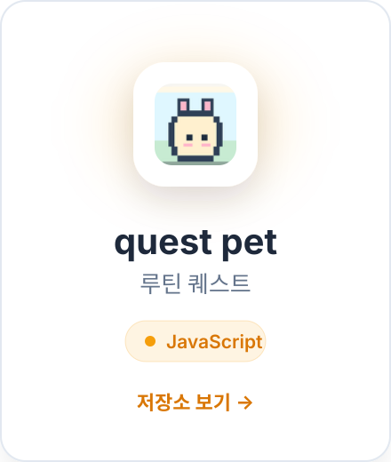
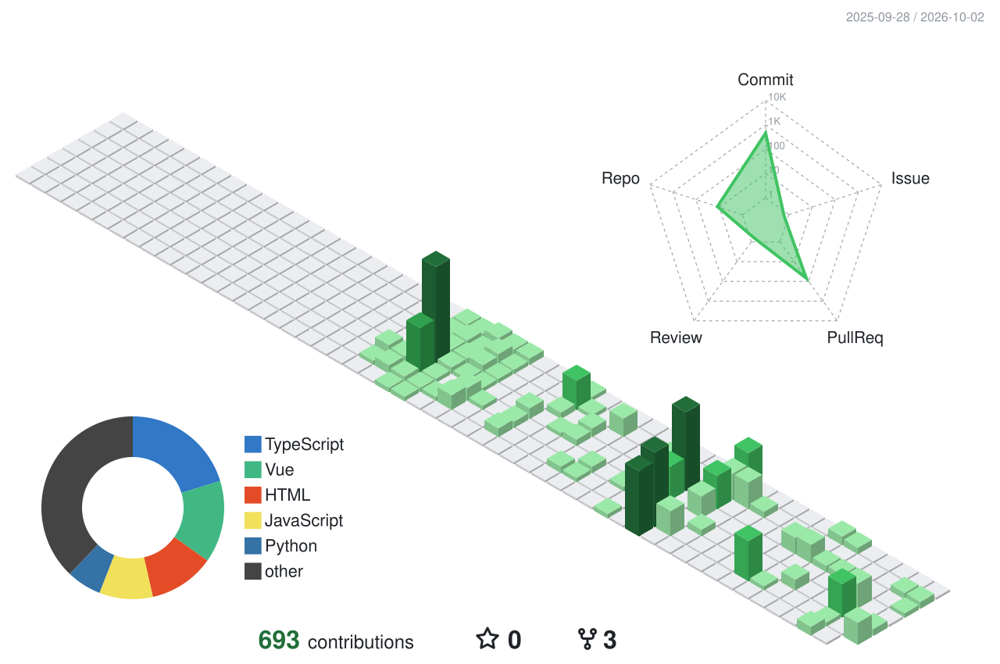

  <picture>
    <source media="(prefers-color-scheme: dark)" srcset="./profile/cards/hero-dark.svg">
    
  </picture>

 

  <a href="https://whtjddlr-readme-launcher.choim2013.workers.dev/go/kok">
    <picture>
      <source media="(prefers-color-scheme: dark)" srcset="./profile/cards/kok-dark.svg">
      
    </picture>
  </a>
  &nbsp;&nbsp;
  <a href="https://whtjddlr-readme-launcher.choim2013.workers.dev/go/bbaru">
    <picture>
      <source media="(prefers-color-scheme: dark)" srcset="./profile/cards/bbaru-dark.svg">
      
    </picture>
  </a>
  &nbsp;&nbsp;
  <a href="https://whtjddlr-readme-launcher.choim2013.workers.dev/go/carch">
    <picture>
      <source media="(prefers-color-scheme: dark)" srcset="./profile/cards/carch-dark.svg">
      
    </picture>
  </a>
   
  <a href="https://whtjddlr-readme-launcher.choim2013.workers.dev/go/planmerge-ai">
    <picture>
      <source media="(prefers-color-scheme: dark)" srcset="./profile/cards/planmerge-ai-dark.svg">
      
    </picture>
  </a>
  &nbsp;&nbsp;
  <a href="https://whtjddlr-readme-launcher.choim2013.workers.dev/go/recycle-vqa">
    <picture>
      <source media="(prefers-color-scheme: dark)" srcset="./profile/cards/recycle-vqa-dark.svg">
      
    </picture>
  </a>
  &nbsp;&nbsp;
  <a href="https://whtjddlr-readme-launcher.choim2013.workers.dev/go/godlife-quest-pet">
    <picture>
      <source media="(prefers-color-scheme: dark)" srcset="./profile/cards/godlife-quest-pet-dark.svg">
      
    </picture>
  </a>

 

  <picture>
    <source media="(prefers-color-scheme: dark)" srcset="./profile-3d-contrib/profile-night-green.svg">
    
  </picture>

 

### ✍️ 최근 글

<!-- BLOG-POST-LIST:START -->
- [[SSAFYcial]AI 코딩 에이전트도 팀플한다? Orca&lpar;오르카&rpar; 알아보기](https://blog.naver.com/solist-/224427922154?fromRss=true&trackingCode=rss)
- [[SSAFYcial]도시락통으로 이해하는 Docker](https://blog.naver.com/solist-/224427915741?fromRss=true&trackingCode=rss)
- [[SSAFYcial] 택배 물류로 이해하는 CI/CD](https://blog.naver.com/solist-/224396199664?fromRss=true&trackingCode=rss)
- [[SSAFYcial] AI도 팀플을 한다고 ?](https://blog.naver.com/solist-/224385393337?fromRss=true&trackingCode=rss)
- [[SSAFYcial]로그인은 어떻게 기억되는 걸까? 쿠키 vs 세션 완전 정복](https://blog.naver.com/solist-/224364036036?fromRss=true&trackingCode=rss)
<!-- BLOG-POST-LIST:END -->
